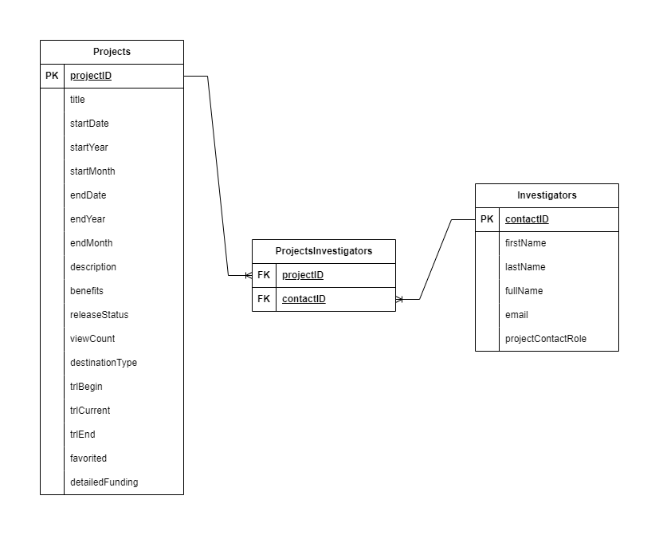

# NASA-API-ETL
Este proyecto es una ETL desarrollada en  **Python** la cual realiza la extracción y transformación desde la [API de la NASA](https://techport.nasa.gov/help/api). Permite almacenar los datos extraídos Proyectos e Investigadores.

## Funcionalidades
La ETL implementada ofrece:

- Extracción y almacenamiento de información de proyectos.
- Transformación de la información extraída para obtener proyectos e investigadores. 

## Estructura del Proyecto

La estructura del proyecto es la siguiente:
```plaintext
INTELIGENTHR
│
├── etl/                        # Directorio principal de la ETL
│   ├── etl_control.py          # Archivo de control de la ETL
│   ├── etl_extract.py          # Archivo de extracción de información de la ETL
│   └── etl_transform.py        # Archivo de transformación de datos de la ETL
│
├── assets/                     # Carpeta con archivos de recursos
│   └── sugested_data_model.png # Modelo de datos sugerifo

├── data/                       # Carpeta principal de datos
├── .gitignores                 # Archivo gitignore
├──  environment.ym             # Archivo de dependencias para entorno virtual
└── .env                        # Variables de entorno para la configuración de la solución

```
## Requisitos

- **Python 3.x**
- **Requests**
- **pandas**
- **dotenv**

## Uso
1. Instalar las dependencias presentes en el archivo requirements.
2. Modificar el párametro initial_date(línea 12) par extraer la información desde esa fecha en el script **etl_control.py**.
3. Ejecutar el archivo **etl_control.py** y disfrutar.

## Modelo de datos sugerido
El diagrama entidad relación sugerido para implementar el esquema de datos es el siguiente:



El modelo contiene las siguientes entidades:
- **Projects:** Almacena la información sobre proyectos.
- **ProjectsInvestigators:** Permite establecer la relación muchos a muchos entre proyectos e investigadores.
- **Investigators** Almacena la información sobre investigadores.
